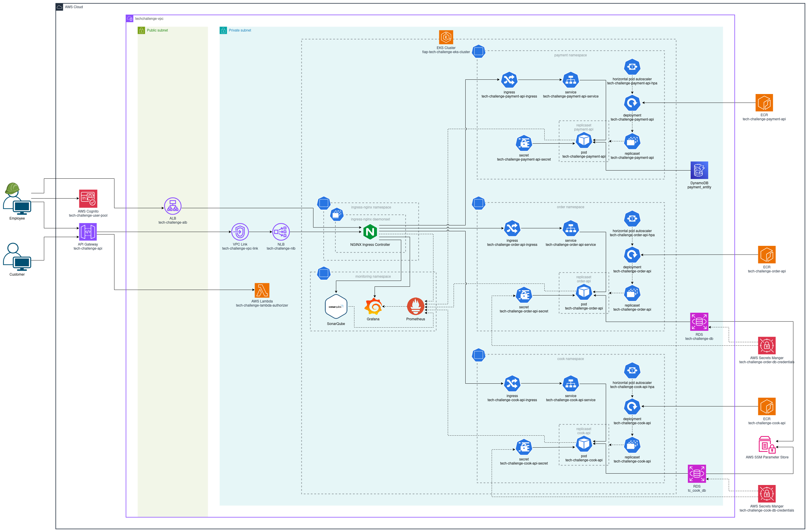
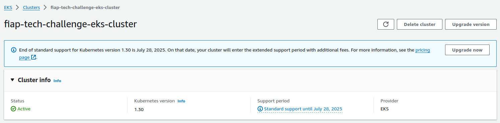

# Tech Challenge - k8s

 

## 💻 Descrição

Este repositório é responsável por criar o cluster e toda a infraestrutura necessária para provisionar a aplicação.

## 🛠 Tecnologias Utilizadas

## ⚙️ Configuração

### Pré-requisitos

1. É necessário executar a pipeline para criar o VPC no repositório: https://github.com/fiap-soat-12/tech-challenge-vpc
2. É necessário executar a pipeline para criar o SQS no repositório: https://github.com/fiap-soat-12/tech-challenge-queue
3. É necessário executar a pipeline para criar a imagem no ECR no repositório e a Infraestrutura da Cook API: https://github.com/fiap-soat-12/tech-challenge-cook-api
4. É necessário executar a pipeline para criar a imagem no ECR no repositório e a Infraestrutura da Order API: https://github.com/fiap-soat-12/tech-challenge-order-api
5. É necessário executar a pipeline para criar a imagem no ECR no repositório e a Infraestrutura da Payment API: https://github.com/fiap-soat-12/tech-challenge-payment-api
6. É necessário executar a pipeline para criar o RDS no repositório: https://github.com/fiap-soat-12/tech-challenge-db

### Desenvolvimento

- **[Kubernetes](https://kubernetes.io/pt-br/docs/home/)**: Documentação oficial do Kubernetes.
- **[Terraform](https://www.terraform.io/)**: Site oficial do Terraform.
- **[AWS](https://aws.amazon.com/pt/)**: Site oficial da AWS.

### Desenho da infraestrutura

## 🚀 Execução

### Subindo aplicação em Cluster EKS
  Caso deseje subir a aplicação em um cluster EKS em uma conta AWS, basta seguir os seguintes passos:
  
  1. Certificar que o Terraform esteja instalado executando o comando `terraform --version`;
  

  2. Certificar que o `aws cli` está instalado e configurado com as credenciais da sua conta AWS;
  

  3. Acessar a pasta `terraform/cluster` que contém os arquivos que irão criar um Cluster EKS e Work Nodes na AWS;
  4. Inicializar o Terraform no projeto `terraform init`;
  5. Verificar que o script do Terraform é valido rodando o comando `terraform validate`;
  6. Executar o comando `terraform plan` para executar o planejamento da execução/implementação;
  7. Executar o comando `terraform apply` para criar a infra dentro do cluster;
  8. Após a execução do Terraform finalizar, verificar se o cluster e os nodes foram inicializados na AWS;
  
  9. Acessar a pasta `terraform/infra` que contém os arquivos que irão criar os Pods da aplicação e do Banco de Dados, os services e os recursos relacionados à monitoração na AWS;
  10. Inicializar o Terraform no projeto `terraform init`;
  11. Verificar que o script do Terraform é valido rodando o comando `terraform validate`;
  12. Executar o comando `terraform plan` para executar o planejamento da execução/implementação;
  13. Executar o comando `terraform apply` para criar a infra dentro do cluster;
